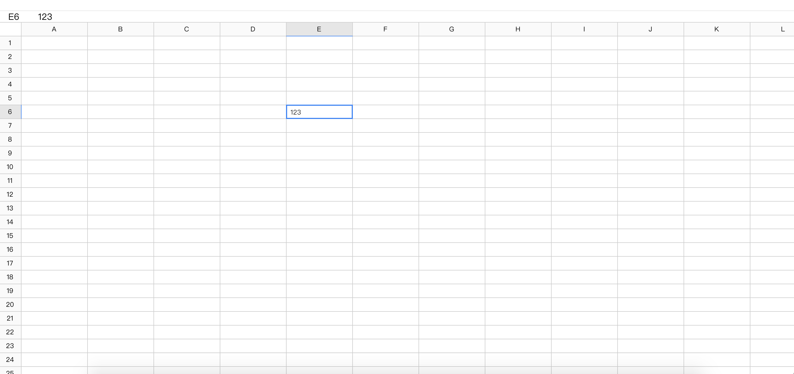

# webExcel

## 安装

```
yarn install
```

### 运行

```
yarn run serve
```

### 说明

```
基于vue开发的webEcel,采用快速的canvas绘画,webworker处理数据,快速高效!
完整的excel的功能过于庞大,由于个人精力有限,仅完成toolbar上的icon功能
保存 撤销 回退 格式刷 清除  粗体 斜体 下划线 删除线 字体颜色 背景色  文字左对齐 文字中间对齐 文字右对齐 拆分单元格 合并单元格
（插入图片 超链接 边框 ？暂缓）

```

### 更新说明

- 支持点击 cell 输入
- 点击 cell 在行列头提示及 head 栏展示位置及值
- 加入滚动条

### 未来

- 加入选中
- 加入单元格合并
- 加入列行拖拽
- 加入删除列行
- 加入顶部 toolBar

### 查看示例

See [demo](https://ggbeng1.github.io/webExcel/)

### 展示图


